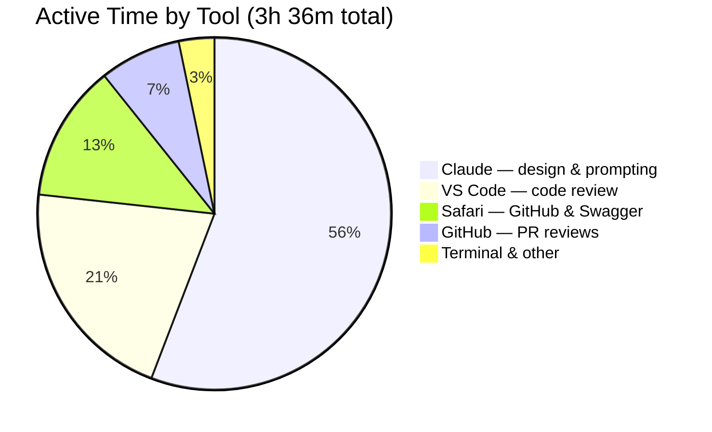
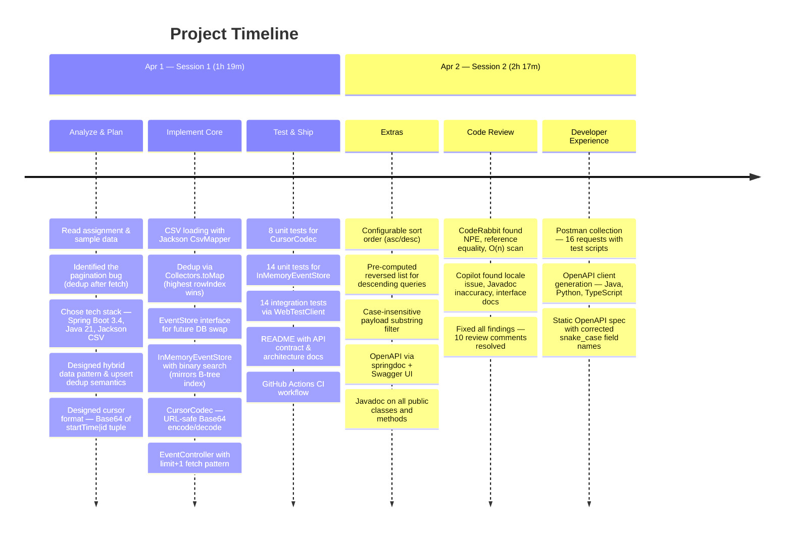

# Events API — Cursor-Based Pagination

**Take-home assessment** for a Backend Java Developer role. A single REST endpoint (`GET /api/events`) returning events for a date range with correct cursor-based pagination — fixing a known bug where the previous engineer's approach caused duplicate events across pages and inflated totals.

## At a Glance

| | Deliverable | Status |
|---|---|---|
| 1 | Correct cursor-based pagination | ✅ Deduplicate at startup, paginate over clean data |
| 2 | 50 automated tests | ✅ No duplicates, no missing IDs, totals match |
| 3 | API contract with curl examples | ✅ 6 parameters, full pagination walkthrough |
| 4 | Sorting & filtering (extras) | ✅ Asc/desc, case-insensitive payload filter |
| 5 | Postman collection | ✅ 16 requests with test scripts |
| 6 | API client generation | ✅ Java, Python, TypeScript via Maven profiles |
| 7 | OpenAPI / Swagger UI | ✅ Interactive docs at `/swagger-ui.html` |
| 8 | Javadoc | ✅ All public classes and methods |
| 9 | GitHub Actions CI | ✅ `./mvnw verify` on every push and PR |


---

## Build Time

This project was completed in **3 hours 36 minutes** of active screen time across two sessions, tracked by [Timing](https://timingapp.com/) (macOS automatic time tracker). Development was **AI-assisted using [Claude Code](https://claude.com/claude-code)** — I drove the architecture, design decisions, and review process while Claude handled implementation, test writing, and boilerplate.





### What this demonstrates

- **AI as a force multiplier, not a replacement.** Every design decision — hybrid data pattern, upsert dedup semantics, cursor format, binary search approach, interface design for future DB migration — was a deliberate human choice that I can explain and defend.
- **Review-driven quality.** CodeRabbit and Copilot found real bugs (NPE on null direction, reference equality, O(n) scan documented as O(log n)). All were addressed, not dismissed.
- **Knowing what to build matters more than typing speed.** The time savings came from clear requirements and fast iteration, not from skipping the thinking.

---

## Setup & Run Instructions

**Prerequisites:** Java 21 (tested with Eclipse Temurin 21.0.5 LTS). No Maven install needed — the wrapper (`./mvnw`) downloads it automatically.

### Maven Targets

```bash
# Run the server
./mvnw spring-boot:run

# Run all tests (unit + integration)
./mvnw test

# Full build lifecycle: compile, test, package
./mvnw verify

# Generate Javadoc HTML (output: target/reports/apidocs/index.html)
./mvnw javadoc:javadoc

# Package as JAR (output: target/events-0.0.1-SNAPSHOT.jar)
./mvnw package

# Clean build artifacts
./mvnw clean

# Generate API clients (Java, Python, TypeScript)
./mvnw generate-sources -Pclient-java
./mvnw generate-sources -Pclient-python
./mvnw generate-sources -Pclient-typescript
```

### Docker

```bash
docker build -t events . && docker run -p 8080:8080 events
```

### What's Running Where

| URL | What |
|---|---|
| http://localhost:8080/api/events?start_time=1708646400&end_time=1710028800 | Events endpoint |
| http://localhost:8080/swagger-ui.html | Interactive API docs (Swagger UI) |
| http://localhost:8080/v3/api-docs | OpenAPI 3.0 JSON spec |
| `target/reports/apidocs/index.html` | Generated Javadoc (after `./mvnw javadoc:javadoc`) |

---

## API Contract

### Endpoint

```
GET /api/events
```

### Request Parameters

| Parameter          | Type    | Required | Default | Description                                              |
|--------------------|---------|----------|---------|----------------------------------------------------------|
| `start_time`       | long    | yes      | —       | Start of date range, inclusive (Unix seconds)             |
| `end_time`         | long    | yes      | —       | End of date range, inclusive (Unix seconds)               |
| `limit`            | integer | no       | 20      | Max events per page (clamped to 1–100)                   |
| `cursor`           | string  | no       | —       | Opaque cursor from a previous `next_cursor`              |
| `direction`        | string  | no       | `asc`   | Sort direction: `asc` or `desc`                          |
| `payload_contains` | string  | no       | —       | Case-insensitive substring filter on event payload       |

### Response Shape

```json
{
  "events": [
    {
      "start_time": 1708646400,
      "id": "evt-a1",
      "payload": "Blue Note - Live Jazz"
    }
  ],
  "next_cursor": "MTcwODY0NjQwMHxldnQtYzM"
}
```

- **`events`**: Array of event objects for the current page, sorted by `start_time` ascending then `id` ascending.
- **`next_cursor`**: Opaque string for the next page, or `null` when this is the last page.

### Pagination Walkthrough

```bash
# Page 1: first 10 events
curl "http://localhost:8080/api/events?start_time=1708646400&end_time=1710028800&limit=10"
# → 10 events + next_cursor="MTcwODczMjgwMHxldnQtZTU"

# Page 2: use next_cursor from page 1
curl "http://localhost:8080/api/events?start_time=1708646400&end_time=1710028800&limit=10&cursor=MTcwODczMjgwMHxldnQtZTU"
# → 10 events + next_cursor="..."

# Page 3
curl "http://localhost:8080/api/events?start_time=1708646400&end_time=1710028800&limit=10&cursor=<cursor_from_page_2>"
# → 10 events + next_cursor="..."

# Page 4 (last page)
curl "http://localhost:8080/api/events?start_time=1708646400&end_time=1710028800&limit=10&cursor=<cursor_from_page_3>"
# → 4 events + next_cursor=null  (done!)

# Total: 10 + 10 + 10 + 4 = 34 unique events
```

**Pagination is complete when `next_cursor` is `null`.**

### Error Responses

| Status | Cause                                      |
|--------|--------------------------------------------|
| 400    | Missing `start_time` or `end_time`         |
| 400    | Invalid or malformed `cursor`              |
| 400    | Invalid `direction` (not `asc` or `desc`)  |

### Postman Collection

A ready-to-use Postman collection is included in the repo. Import it to explore every endpoint scenario without writing a single request by hand.

```
postman/
  events-api.postman_collection.json    # 16 requests across 5 folders
  local.postman_environment.json        # {{base_url}}, {{start_time}}, {{end_time}}, {{next_cursor}}
```

**Quick start:**

1. Start the server: `./mvnw spring-boot:run`
2. In Postman: **File → Import** → select both files from the `postman/` folder
3. Select the **Events API — Local** environment (top-right dropdown)
4. Run any request, or use the **Collection Runner** on the "Pagination Walk" folder to page through all 34 events automatically

**What's included:**

| Folder | Requests | What it tests |
|--------|----------|---------------|
| Happy Path | 3 | Default limit, single-page fetch, small pages |
| Pagination Walk | 4 | Sequential page-through (auto-captures `next_cursor` between requests) |
| Sorting | 2 | Ascending vs descending order |
| Filtering | 3 | Payload substring, no matches, combined filter + sort |
| Edge Cases & Errors | 6 | Empty range, limit=1, missing params (400), invalid cursor (400), invalid direction (400) |

Each request in the Pagination Walk and Edge Cases folders includes **test scripts** that validate status codes, array sizes, and cursor presence — so the Collection Runner gives you a green/red pass/fail summary.

### Generated API Clients

The OpenAPI spec (`openapi/events-api.json`) powers auto-generated clients in multiple languages via the [OpenAPI Generator](https://openapi-generator.tech/) Maven plugin. No extra installs required — just run a profile:

```bash
# Generate a Java client (java.net.http, Jakarta EE)
./mvnw generate-sources -Pclient-java
# → target/generated-clients/java/

# Generate a Python client
./mvnw generate-sources -Pclient-python
# → target/generated-clients/python/

# Generate a TypeScript client (fetch-based)
./mvnw generate-sources -Pclient-typescript
# → target/generated-clients/typescript/
```

Each generated client includes models (`Event`, `EventPageResponse`), an API class with the `getEvents` method fully typed, and a README with usage instructions. The spec file is committed to the repo so clients can be generated without running the server.

### Interactive API Docs

When the server is running, Swagger UI is available at:

- **Swagger UI:** [http://localhost:8080/swagger-ui.html](http://localhost:8080/swagger-ui.html)
- **OpenAPI spec:** [http://localhost:8080/v3/api-docs](http://localhost:8080/v3/api-docs)

### Sorting

Results are sorted by `start_time` with `id` as a stable tie-breaker. Use `direction=desc` to reverse the order. **The cursor must be used with the same sort direction that produced it** — mixing directions with a cursor from a different direction produces undefined results.

```bash
# Descending: most recent events first
curl "http://localhost:8080/api/events?start_time=1708646400&end_time=1710028800&limit=5&direction=desc"
```

### Filtering

Use `payload_contains` to filter events by a substring in their payload (case-insensitive). The filter is applied before pagination, so paginated totals remain consistent with non-paginated totals when the same filter is used.

```bash
# Only events mentioning "Jazz"
curl "http://localhost:8080/api/events?start_time=1708646400&end_time=1710028800&payload_contains=Jazz"
```

---

## Architecture & Design Decisions

### The Bug Fix

The original pagination was broken because deduplication happened *after* fetching `limit + 1` rows. When duplicates were removed, the effective page size shrank, and the cursor was derived from a position that didn't account for the removed rows. This caused events to appear on multiple pages.

**The fix:** Deduplicate once at startup, then paginate over clean data. The cursor always points to a unique position in a stable, sorted list — no post-fetch dedup means no off-by-one errors.

### Hybrid Data Pattern

Raw CSV rows are parsed in full (50 rows), then a deduplicated "materialized view" is built at startup (34 unique events). This mirrors how a database materialized view works:

- **Raw rows** = source of truth (preserved if needed for audit, re-processing)
- **Materialized view** = fast, consistent reads for the API

This pattern is extensible — if the data source changes (e.g., a database, a stream), the `EventStore` interface stays the same.

### Deduplication: Upsert Semantics

When multiple CSV rows share the same `id`, the row with the highest `row_index` wins. Motivation: treat later rows as updates to earlier ones, always serving the latest data. This is documented, testable, and easy to explain.

### Cursor Design

- **Format:** URL-safe Base64 encoding of `"startTime|id"` (e.g., `1708646400|evt-c3` → `MTcwODY0NjQwMHxldnQtYzM`)
- **Semantics:** "Start after this position" — the next page returns events where `(start_time, id) > (cursor_time, cursor_id)`.
- **Why it's correct:** The `(start_time, id)` tuple is unique in the deduplicated view (since `id` is unique). This means every cursor points to exactly one position — no ambiguity, no skipped or repeated events.
- **Base64 is not comparable.** The encoding is purely an opaque transport layer. The server decodes the cursor, then performs the comparison on the raw `long` and `String` values. Clients should never parse, construct, or compare cursors — just pass them back verbatim.

### Leveraging Standard Java: `Comparable` and Binary Search

The `Event` record implements `Comparable<Event>` with natural ordering by `(startTime, id)`. This one decision enables cursor resolution via `Collections.binarySearch` — the same algorithm a database B-tree index on `(start_time, id)` would use, but over a plain `ArrayList`.

When a cursor arrives, we construct a synthetic `Event` as a search key and binary-search for its position. If found, we start at `index + 1` (strictly after). If not found, `binarySearch` returns the insertion point — already the first element greater than the cursor. This gives us **O(log n) cursor resolution** with zero external dependencies.

A database-backed `EventStore` would replace the binary search with a composite `WHERE` clause:

```sql
WHERE (start_time, id) > (:cursorTime, :cursorId)
  AND start_time BETWEEN :rangeStart AND :rangeEnd
ORDER BY start_time, id
LIMIT :limit + 1
```

With an index on `(start_time, id)`, the database performs the same logical operation. The `EventStore` interface stays unchanged — only the implementation swaps out.

### Cursor-Based Pagination: Tradeoffs and Future Directions

Cursor-based pagination provides **correctness guarantees** (no duplicates, no skips, stable under concurrent writes) but comes with a fundamental tradeoff: **no random page access**. You cannot jump to "page 5" without walking pages 1–4, because each cursor encodes a position relative to the data, not an absolute offset.

**Approaches for skip-ahead UX (if needed):**

| Pattern | How it works | Tradeoff |
|---|---|---|
| **Precomputed landmarks** | Server returns cursors for predetermined positions (e.g., page 1, 5, 10, last) alongside each response | Requires knowing total count and pre-scanning at fixed intervals; adds response overhead |
| **Offset hybrid** | Add an `offset` param alongside cursors | Breaks consistency if data changes between requests; fine for static datasets |
| **Jump by N events** | Client requests "skip 50 events" as a cursor modifier | Essentially `OFFSET` in disguise — same consistency risks |

**Choosing the right pagination strategy depends on the access pattern:**

| Need | Strategy | Example |
|---|---|---|
| Sequential iteration through a changing dataset | **Cursor-based** | Syncing events, streaming, ETL pipelines |
| "Go to page N" UI with a stable dataset | **Offset-based** | Admin dashboard, search results table |
| Both: consistent iteration + random access | **Keyset pagination with count** | API with `total_count` in response + cursors |

For this API, the expected consumption pattern is sequential iteration — fetch all events in a date range, page by page — so cursor-based pagination is the correct choice.

### When This Outgrows In-Memory

The current implementation loads CSV into an `ArrayList` and uses binary search. This works well for small, static datasets. As requirements grow, the architecture naturally points toward a database:

| New requirement | Why in-memory breaks down | What a database provides |
|---|---|---|
| **Random page access** | Would need to precompute and cache all page boundaries | `OFFSET` / `LIMIT` with an index, or keyset pagination |
| **Configurable sort order** | Need a separate sorted list per sort field, or re-sort on every request | Indexes on each sortable column; query planner picks the right one |
| **Filtering** (payload search, id prefix) | Linear scan over the full dataset for each request | `WHERE` clauses backed by indexes; full-text search for payload |
| **Concurrent writes** | Mutable shared state requires synchronization, invalidates cursors | MVCC / transactions provide isolation; cursors remain valid against a consistent snapshot |
| **Large datasets** | Memory-bound; 100K+ events won't fit comfortably | Disk-backed storage with buffer pool; only the working set is in memory |

**The `EventStore` interface was designed with this in mind.** Swapping `InMemoryEventStore` for a `JdbcEventStore` or `MongoEventStore` requires no changes to the controller, cursor codec, or tests — only a new implementation of the same interface. The composite `WHERE (start_time, id) > (:cursor)` pattern works identically in PostgreSQL, MySQL, or MongoDB's `$gt` operator.

A relational database (PostgreSQL, MySQL) is the natural next step for sorted, filtered, paginated queries. A document store (MongoDB) fits if the event schema is heterogeneous or deeply nested. Either way, the cursor design and API contract remain unchanged — the pagination strategy is independent of the storage engine.

### Tech Stack

| Choice             | Rationale                                                  |
|--------------------|------------------------------------------------------------|
| Spring Boot 3.4    | Latest stable, Java 21 support, assessment-friendly        |
| Java 21 LTS        | Records, pattern matching, virtual threads support         |
| Jackson CSV        | Zero new dependency tree (Jackson already in Spring Boot)  |
| AssertJ            | Fluent assertions, already in spring-boot-starter-test     |
| WebTestClient      | Modern integration testing for Spring Boot 3.x             |

### Package Structure

```
io.github.mattmck.events
  ├── api/           # REST controller and response DTOs
  ├── config/        # CSV loading and bean configuration
  ├── cursor/        # Cursor encoding/decoding
  ├── model/         # Domain records (CsvRow, Event)
  └── store/         # Data access interface and implementation
```

---

## Test Coverage

**50 tests** across 3 test classes:

| Class                                | Type        | Tests | Covers                                                          |
|--------------------------------------|-------------|-------|-----------------------------------------------------------------|
| `CursorCodecTests`                   | Unit        | 8     | Encode/decode round-trips, malformed input, edge cases          |
| `InMemoryEventStoreTests`            | Unit        | 21    | Dedup, range queries, cursor advancement, sorting, filtering    |
| `EventControllerIntegrationTests`    | Integration | 21    | Full HTTP round-trips, pagination, sorting, filtering, errors   |

Key assertions proving pagination correctness:
- `paginatedTotalMatchesNonPaginatedTotal` — paginating with limit=5 yields 34 unique events, same as a single large request
- `noDuplicateIdsAcrossPages` — no event ID appears on more than one page
- `noMissingIdsAcrossPages` — paginated set equals non-paginated set exactly
- `paginationWorksWithVariousLimits` — tested with limits 1, 3, 7, 10, 17, and 34

---

## Development Process

### Branching Strategy

Each milestone gets its own feature branch off `main`, with one commit per logical unit of work. PRs are reviewed via [CodeRabbit](https://coderabbit.ai) before merging.

| Branch pattern | Purpose | Merges to |
|---|---|---|
| `main` | Stable, passing builds only | — |
| `milestone-N/description` | Feature work for a specific milestone | `main` via PR |

**Milestones 1–4** (project setup, core API, tests, docs) landed in a single commit on `main` as the initial implementation. From Milestone 5 onward, each issue gets a dedicated commit on a feature branch with a PR for review.

### CI

GitHub Actions runs `./mvnw verify` on every push and PR. The workflow tests against Java 21 LTS. PRs must pass CI before merging.

---

---

<details>
<summary><strong>Original Assignment</strong> (click to expand)</summary>

## The Setup

You are taking over an **Events API**. Your task is to build a **single remote endpoint** (e.g. REST over HTTP) that returns events for a **date range** using **cursor-based pagination**. The deliverable is a **callable HTTP API**, not an in-process Java interface—clients should be able to hit the endpoint with a tool like `curl` or a REST client.

- **Input:** Start date, end date (for the range), optional `limit`, optional `cursor`.
- **Output:** A page of events plus a `next_cursor` when more results exist. Results are ordered by `start_time` (ascending) with a stable tie-breaker (e.g. `id` or `row_index`).
- You may use any framework (Spring, etc.) or database. Loading the provided CSV into memory is acceptable.

The repo includes `sample_data.csv` — treat it as the raw "database" rows. Ingest it however you like (e.g., at startup or on first request).

## The Scenario (The Bug)

The previous engineer implemented pagination with the following logic:

1. Fetch `limit + 1` rows from the data store (ordered by `start_time`, then by a tie-breaker such as `id` or `row_index`).
2. **De-duplicate by `id` in memory** (e.g., keep first occurrence per `id`).
3. Take the **first `limit` items** from the de-duplicated list.
4. Set **`next_cursor`** from the **last item** in this de-duplicated return array (e.g., encode `start_time` and `id` of that last item).

The intent was to avoid duplicates in the API response while still using a "fetch one extra row" pattern to detect if there is a next page.

## The Symptoms

Clients are reporting:

- **Overlapping events** across pages: the same logical event (same `id`) sometimes appears on more than one page.
- **Higher total event counts** when paginating through all pages than when fetching all records in a single request (e.g., with a very large limit or no pagination).

## The Assignment

### 1. Implementation

Build the API endpoint from scratch with **correct cursor derivation** so that:

- Each logical event (by `id`) appears **at most once** across all pages.
- The **total number of distinct events** returned when paginating through all pages equals the total number of distinct events in the date range (no inflation, no missing IDs).
- Cursor semantics are stable and unambiguous (e.g., "start after this position" or "start at this position" clearly defined).

You own the choice of cursor format (opaque string, base64-encoded tuple, etc.) and the exact request/response shape.

### 2. Testing

Write **unit and/or integration tests** that prove pagination is correct. Unit tests (e.g. testing your pagination/cursor logic in isolation) and integration tests (e.g. calling the HTTP endpoint) are both acceptable—use whatever mix best demonstrates correctness. The test suite must be runnable without manual steps (e.g. via your build tool). At minimum, your tests must verify:

- **Totals match:** The sum of distinct event IDs over all paginated pages equals the total distinct event count for the same date range when fetched without pagination (or with a single "get all" call).
- **No duplicates:** No event `id` appears more than once across all pages for a given date range and limit.
- **No missing IDs:** Every distinct event in the date range appears in exactly one page (no events skipped).

Feel free to add more tests (e.g., empty range, single page, cursor stability, boundary times).

### 3. API Contract

Document how clients should consume this API:

- Request parameters (e.g., `start_time`, `end_time`, `limit`, `cursor`).
- Response shape (e.g., `events`, `next_cursor`, and when `next_cursor` is absent or null).
- How to use `next_cursor` to request the next page and how to know when pagination is complete.

Put this in your README or a dedicated API doc so that an integration engineer could implement a client without reading your source code.

## Extras (optional)

If you have time and want to go further:

- **Sorting** — Support a configurable sort order (e.g. `order_by=start_time` with `asc` / `desc`). The cursor must be derived from the same ordering used for the query; document how sort parameters affect the cursor.
- **Filters** — Support at least one simple filter (e.g. by `id` prefix, or `payload` contains a substring). Ensure paginated totals and "get all" totals stay consistent when the filter is applied.

These are not required. The core assignment is date range + cursor-based pagination with correct cursor logic.

## Data: `sample_data.csv`

- **Columns:** `row_index`, `start_time` (Unix timestamp), `id`, `payload`.
- **Note:** The dataset intentionally contains **duplicate rows** (same `start_time` and `id`, different `row_index`) to exercise de-duplication and cursor logic. Your implementation must handle these correctly so that each logical event appears once and cursor boundaries are unambiguous.

For more detail on what we expect (API type, tests, documentation), see [Expectations](EXPECTATIONS.md).

</details>
